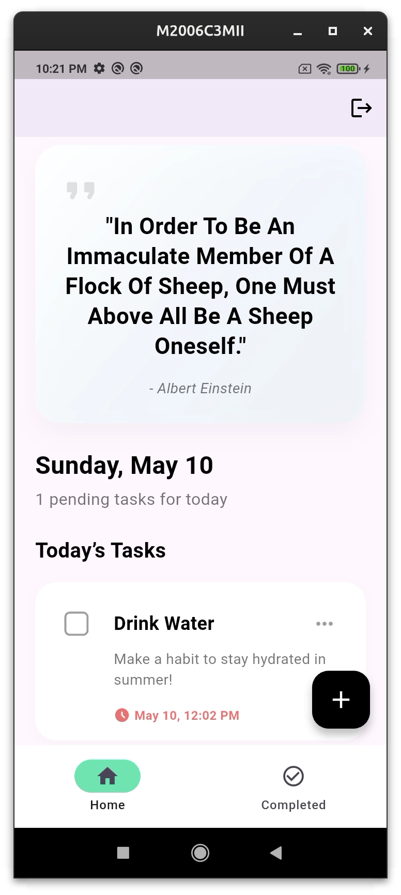
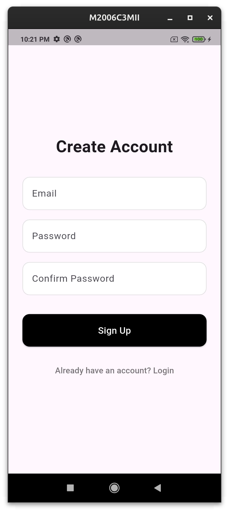
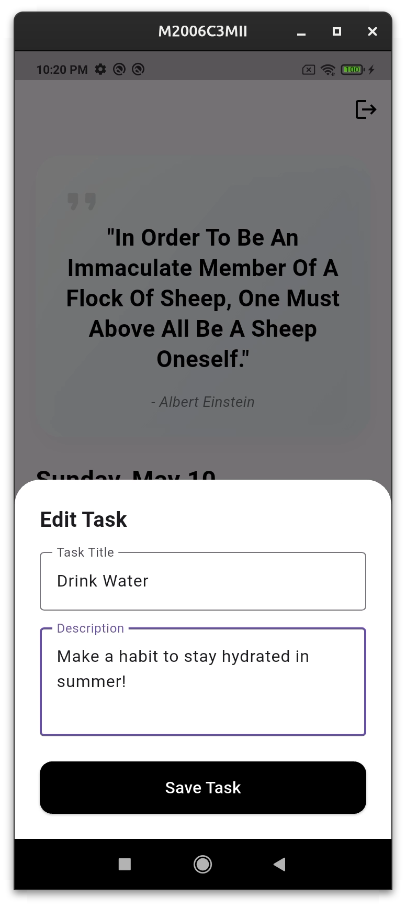

# Tasker - Flutter Task Manager App

A modern cross-platform Task Manager application built with Flutter and Firebase.  
Tasker helps users manage daily tasks efficiently with authentication, real-time database support, and motivational quotes integration.

## Download Here

  

## ✨ Features

### 🔐 User Authentication
Implemented using Firebase Authentication.

- User Sign Up
- User Login
- Secure Logout Functionality

### ✅ Task Management
Implemented using Cloud Firestore.

Users can:

- Add Tasks
- Edit Tasks
- Delete Tasks
- Mark Tasks as Completed

Each task contains:

- Title
- Description
- Date
- Status

### 🌐 REST API Integration
Integrated motivational quotes using the Quotable API.

API Used:
https://dummyjson.com/quotes/random

Displays:

- Quote
- Author

## 📱 Screenshots

  
  
  

## 🛠 Tech Stack

### Frontend
- Flutter
- Dart

### Backend & Database
- Firebase Authentication
- Cloud Firestore

### API Integration
- REST API
- HTTP Package
